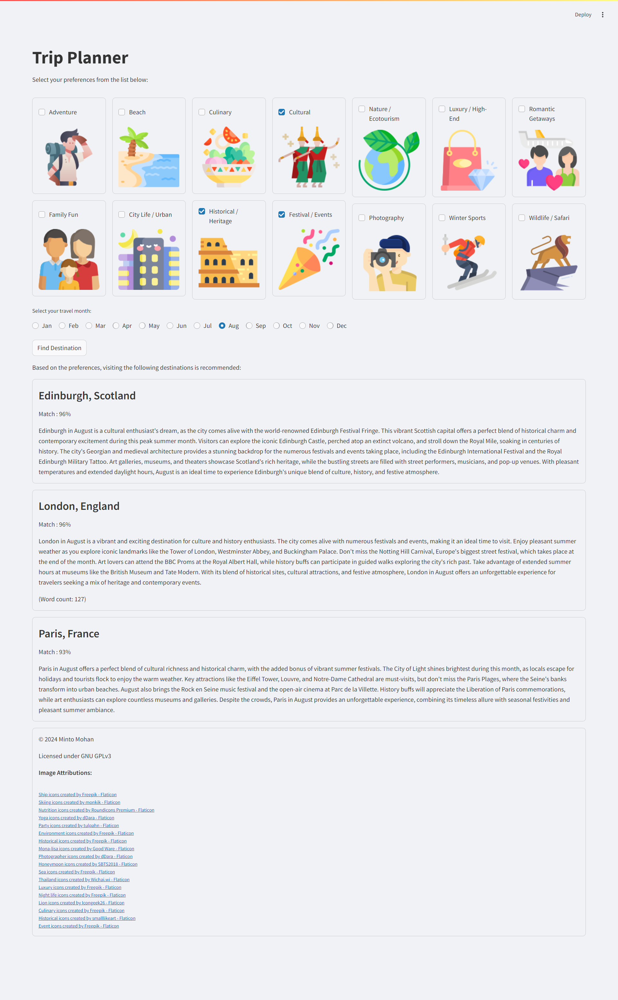

# AI Trip Planner

## Table of Contents
- [Overview](#overview)
- [Features](#features)
- [Installation](#installation)
- [Usage](#usage)
- [Technologies Used](#technologies-used)
- [License](#license)
- [Acknowledgments](#acknowledgments)

## Overview
The AI Trip Planner is an intelligent solution designed to provide personalized travel recommendations based on user preferences. Leveraging advanced natural language processing and machine learning algorithms, the AI Trip Planner helps users discover the best destinations suited to their interests and travel dates.



## Features
- **Personalized Recommendations**: Get travel destination suggestions tailored to your preferences and selected month.
- **AI-Powered Summaries**: Receive detailed summaries and key attractions for each recommended destination.
- **Scalable and Configurable**: Easily configure the and destination list and user preference categories.

## Installation
1. **Clone the repository**
    ```bash
    git clone https://github.com/mintomohan/ai-trip-planner.git
    cd ai-trip-planner
    ```
2. **Create and activate a virtual environment**
    ```bash
    python -m venv venv
    source venv/bin/activate  # On Windows use `venv\Scripts\activate`
    ```
3. **Install dependencies**
    ```bash
    pip install -r requirements.txt
    ```

## Usage
1. **Configure the environment**
    Create a `.env` file in the root directory and add your API keys and other configurations as needed.
    ```plaintext
    ANTHROPIC_API_KEY=your_key_here
    ```

2. **Run the main script**
    ```bash
    streamlit run app/main.py
    ```

## Technologies Used
- **Python**: Core programming language.
- **LangChain Anthropic**: Language model for generating content.
- **Pandas & NumPy**: Numerical computing.
- **Streamlit**: GUI.

## License
This project is licensed under the GNU GPL v3 License. See the [LICENSE](LICENSE) file for details.

## Acknowledgments
- **Flaticon**: Icons used in the project are provided by Flaticon.
- **Freepik**: Ship and Environment icons.
- **monkik**: Skiing icons.
- **Roundicons Premium**: Nutrition icons.
- **dDara**: Yoga and Photographer icons.
- **tulpahn**: Party icons.
- **Good Ware**: Mona Lisa icons.
- **SBTS2018**: Honeymoon icons.
- **Wichai.wi**: Thailand icons.
- **Icongeek26**: Lion icons.
- **smalllikeart**: Historical icons.
- **Other Contributors**: Special thanks to all contributors and open-source projects that helped make this project possible.
